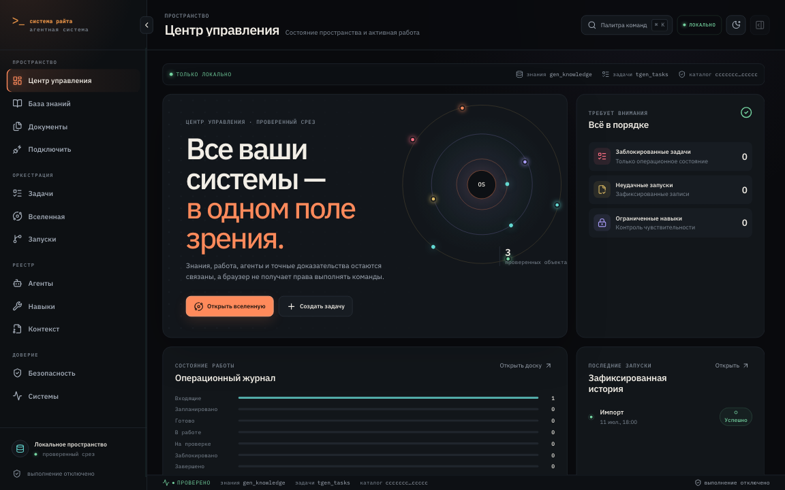
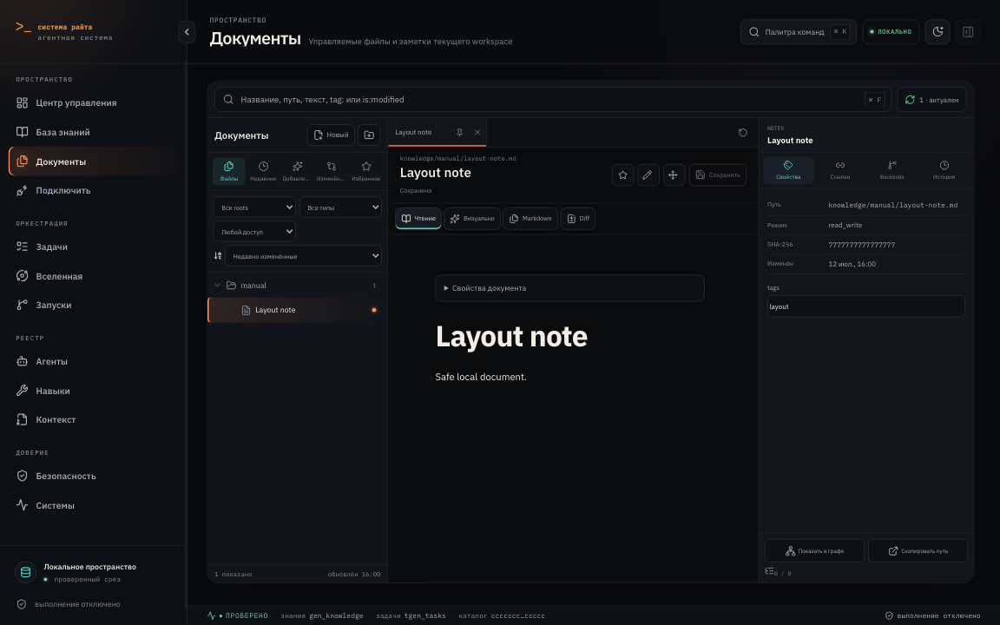
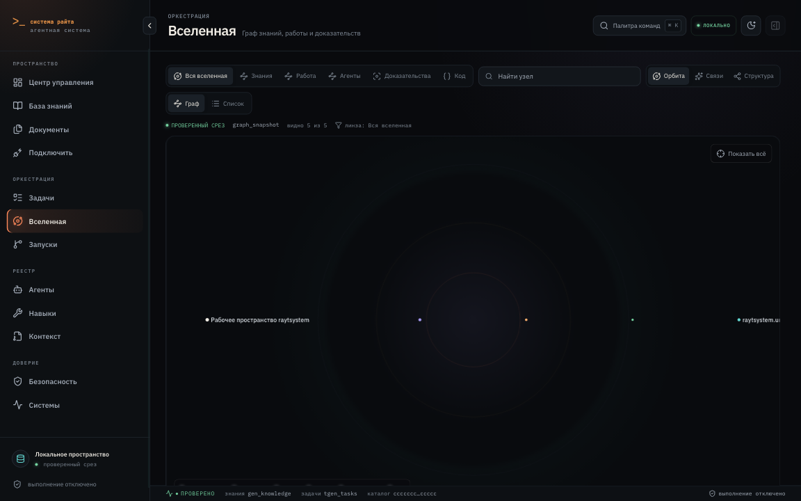
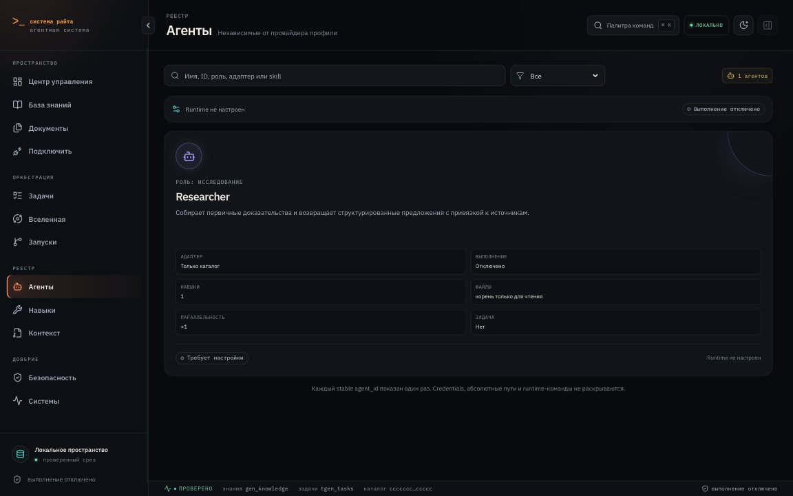
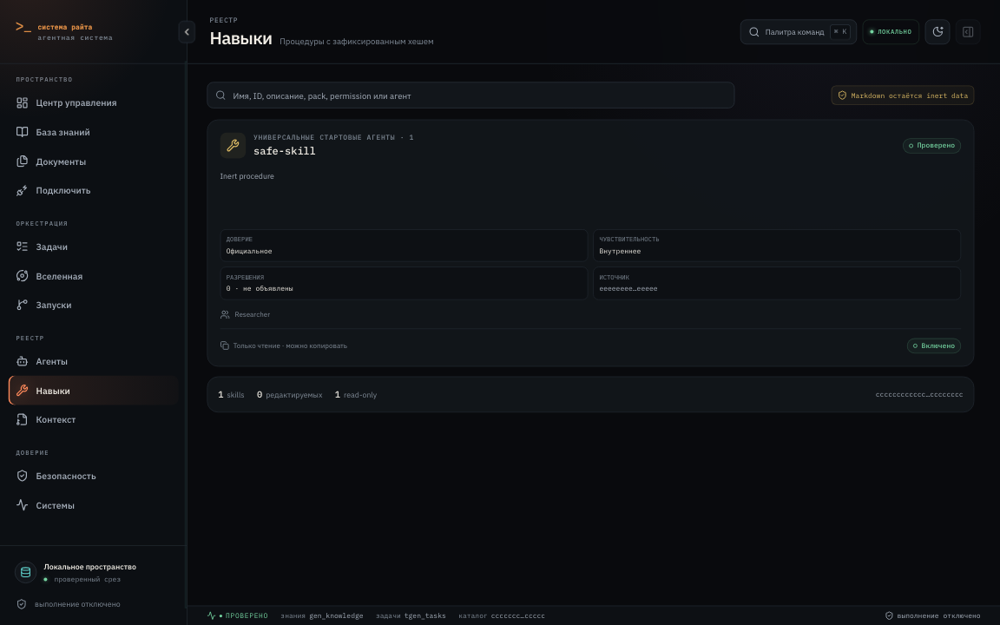
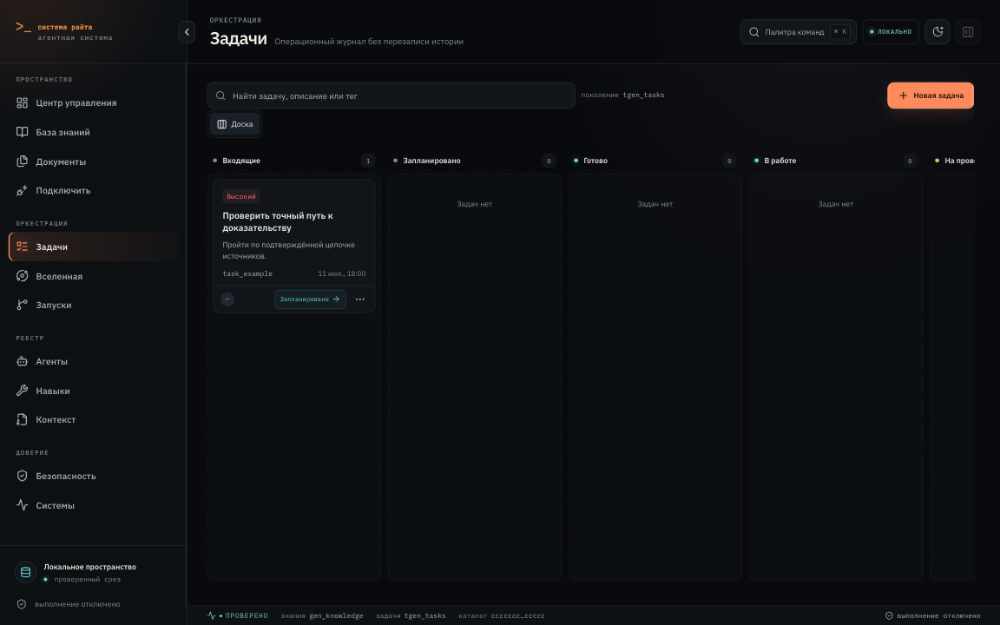
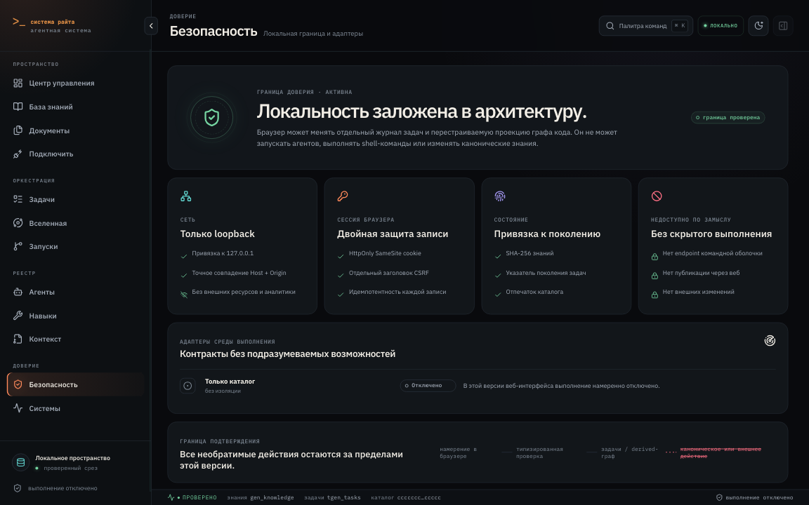

<p align="center">
  
</p>

<h1 align="center">raytsystem</h1>

<p align="center">
  <strong>English</strong> · <a href="README.ru.md">Русский</a>
</p>

<p align="center">
  A local-first, self-hosted workspace for agent-assisted knowledge, tasks, documents, and verifiable workflows.
</p>

<p align="center">
  <a href="https://github.com/romarayt/raytsystem-public-os/actions/workflows/ci.yml"></a>
  <a href="https://github.com/romarayt/raytsystem-public-os/actions/workflows/docs.yml"></a>
  <a href="https://github.com/romarayt/raytsystem-public-os/actions/workflows/codeql.yml"></a>
  <a href="LICENSE"></a>
  
</p>

raytsystem gives individuals and small teams one loopback-only control plane for working with
documents, evidence, tasks, agents, skills, runs, and safety controls without making a cloud account
the center of the system.

> **Project status:** pre-1.0. raytsystem does not claim production readiness. Local deterministic
> flows and the loopback web interface are available; provider execution and external effects are
> disabled by default, while several integration surfaces remain experimental.

## Screenshots



<table>
  <tr>
    <td></td>
    <td></td>
  </tr>
  <tr>
    <td></td>
    <td></td>
  </tr>
  <tr>
    <td></td>
    <td></td>
  </tr>
</table>

All public screenshots are generated from synthetic demo data with
`npm --prefix web run screenshots:github`.

## What raytsystem does

- Shows verified workspace, task, run, and safety state in a local Command Center.
- Works with policy-allowed Markdown through Documents, search, backlinks, history, source mode,
  and guarded visual editing.
- Explores knowledge, evidence, work, agents, and code in the Knowledge Universe.
- Manages durable tasks with dependencies, explicit transitions, idempotency, and immutable history.
- Inspects agents, Skills, contexts, permissions, and runtime availability without executing imported
  instructions.
- Runs provenance-bound INGEST, QUERY, LINT, SAVE, RESEARCH, REVIEW, and security workflows.
- Exposes feature gates, approvals, emergency controls, traces, and disabled external boundaries.
- Serves the same-origin interface on `127.0.0.1` only.

## Current status

| Status | Capabilities |
|---|---|
| Available | Python CLI, loopback web UI, Documents, local task ledger, catalog inspection, deterministic ingest/query/lint/save flows, code graph, backup/restore primitives |
| Experimental | Managed Documents writes, Tool Hub media adapters, protocol surfaces, workflow execution controls, some migration and recovery paths |
| Disabled by default | Real model/provider execution, external MCP execution, notifications, hosted evaluation generation, OTLP export, A2A network exposure, external KMS |
| Planned | Broader platform qualification, packaged installers, native Windows validation, stable preconfigured provider adapters |

A visible screen or CLI group does not imply that its external runtime is enabled. See
[capabilities and limits](website/docs/getting-started/capabilities-and-limits.md) and
[platform status](docs/STATUS.md) for evidence and feature flags.

## Quick start

Requirements: macOS or Linux; Windows through WSL 2; Python 3.12–3.14; and
[uv](https://docs.astral.sh/uv/). Node.js is not required for normal use because the reviewed web
bundle is checked in. Node.js 22 is used only to develop or rebuild the UI and documentation.

```bash
git clone https://github.com/romarayt/raytsystem-public-os.git raytsystem
cd raytsystem
uv sync --dev
uv run raytsystem doctor
uv run raytsystem start
```

`start` is the supported short alias for `ui`. It opens `http://127.0.0.1:8765`; use `Ctrl+C` in
the launching terminal to stop it. The current release refuses non-loopback binds. No API key,
cloud account, or browser extension is required for this safe local start.

Detailed guides: [installation](website/docs/getting-started/installation.md),
[first run](website/docs/getting-started/first-run.md),
[upgrading](website/docs/getting-started/upgrading.md),
[backup and restore](website/docs/security/secrets-backup.md), and
[uninstall](website/docs/getting-started/uninstall.md).

## Start without terminal-heavy workflows

After the one-time Python/uv installation, open the repository folder in a supported agent host and
ask in natural language, for example: **"Start raytsystem"**, **"Запусти raytsystem"**, or
**"Open the interface"**. The `start` Skill checks the workspace, previews installation when needed,
asks before writing, and launches the local interface.

- Codex reads `AGENTS.md` and the adapters in `.agents/skills/`.
- Claude Code reads `CLAUDE.md` and the adapters in `.claude/skills/`.
- ChatGPT Work uses `WORK.md` as its explicit entry point when that project surface is available.

Skills are agent instructions, not executable documents. They do not bypass approvals or turn
imported content into authority. Initial dependency installation and keeping the local server alive
may still require a terminal supplied by the host.

Read [Using Skills without terminal-heavy workflows](website/docs/getting-started/using-skills-without-terminal.md)
for host-specific setup, examples, approval boundaries, and result locations.

## Core Skills

| What you want | What to ask the agent | Skill | Result |
|---|---|---|---|
| Start the system | "Start raytsystem" / "Запусти raytsystem" | `start` | Environment check, previewed setup if needed, local interface |
| Refresh the code graph | "Update the project graph" / "Обнови граф проекта" | `graph` | Current disposable code graph |
| Add a source | "Import this file…" | `raytsystem-ingest` | Validated ingest proposal; real promotion requires approval |
| Ask the knowledge base | "Find in the knowledge base…" | `raytsystem-query` | Evidence-bound answer or explicit gap |
| Check integrity | "Check the knowledge base integrity" | `raytsystem-lint` | Deterministic lint report |
| Preserve a synthesis | "Save this conclusion…" | `raytsystem-save` | Reviewable DRAFT bundle, never publication |
| Research a topic | "Research this topic…" | `raytsystem-research` | Provenance-rich draft evidence handoff |
| Review a run | "Review this run" | `raytsystem-run-review` | Independent findings and gate result |
| Review security | "Run a security review" | `raytsystem-security-review` | Threat-model findings without mutation |
| Inspect media | "Watch this video…" | `raytsystem-watch` | Evidence-bound transcript/visual summary under Tool Hub policy |

## Interface tour

- **Command Center** — workspace health, tasks, runs, and safety status.
- **Documents** — Markdown navigation, search, backlinks, history, source and visual modes.
- **Knowledge Universe** — evidence, knowledge, work, code, and agent relationships.
- **Agents and Skills** — definitions, permissions, availability, conflicts, and editing boundaries.
- **Tasks and Runs** — durable work state, dependencies, execution records, and recovery context.
- **Safety and Systems** — approvals, feature flags, adapters, emergency controls, and diagnostics.

## Security model

- Local-first and loopback-only web serving.
- Default-deny external send, upload, publish, push, payment, deletion, private-corpus egress, and
  real-corpus promotion.
- Same-origin session, CSRF, and idempotency checks for mutating browser requests.
- Imported files and catalog Markdown remain untrusted data, never routing instructions.
- Canonical `_raw`, `normalized`, `ledger`, and generated knowledge are changed only through their
  owning validated workflows, never by direct editing.
- Secrets, local databases, archives, logs, caches, runtime state, and private corpus are excluded
  from the public repository and checked in CI.

See [SECURITY.md](SECURITY.md). Report vulnerabilities privately to Roma Rayt via
[@romarayt on Telegram](https://t.me/romarayt); do not open a public security issue.

## Documentation

The **raytsystem Documentation** site is configured for
[https://romarayt.github.io/raytsystem-public-os/](https://romarayt.github.io/raytsystem-public-os/).
It becomes available after GitHub Pages is enabled. Its source lives in `website/`, is built on
every pull request, and deploys only from a green `main` build.

## Development

```bash
uv sync --dev
uv run pytest
uv run ruff check .
uv run ruff format --check .
uv run mypy
uv run pre-commit run --all-files

npm --prefix web ci
npm --prefix web run browser:install
npm --prefix web run test
npm --prefix web run test:visual
npm --prefix web run build

npm --prefix website ci
npm --prefix website run typecheck
npm --prefix website run build
```

See [CONTRIBUTING.md](CONTRIBUTING.md), [GOVERNANCE.md](GOVERNANCE.md),
[ROADMAP.md](ROADMAP.md), and [CHANGELOG.md](CHANGELOG.md).

## Support and security

- Usage and contribution support: [SUPPORT.md](SUPPORT.md)
- Private vulnerability reporting: [SECURITY.md](SECURITY.md)
- Maintainer and project channel: Roma Rayt — [@romarayt](https://t.me/romarayt)
- Bugs and improvements: [GitHub Issues](https://github.com/romarayt/raytsystem-public-os/issues)

## License

raytsystem is licensed under [Apache License 2.0](LICENSE). Attribution and direct dependency notes
are in [NOTICE](NOTICE), [AUTHORS.md](AUTHORS.md),
[CITATION.cff](CITATION.cff), and [third-party notices](docs/THIRD_PARTY_NOTICES.md).
